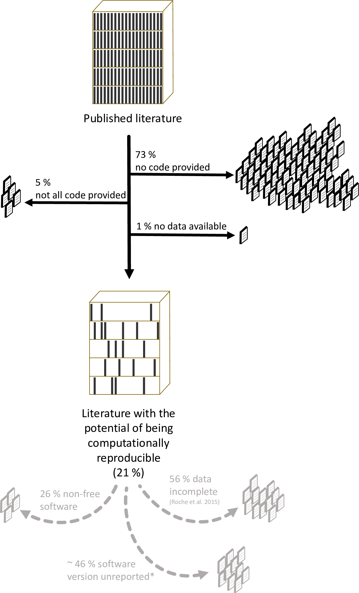
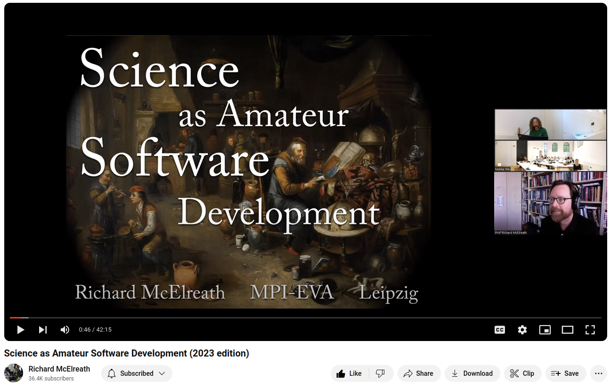
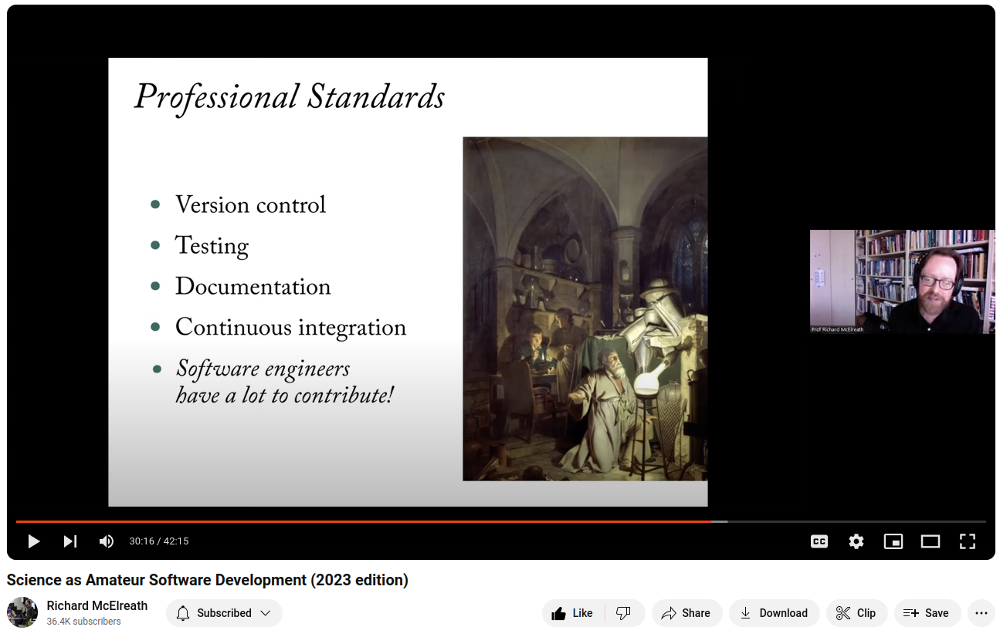
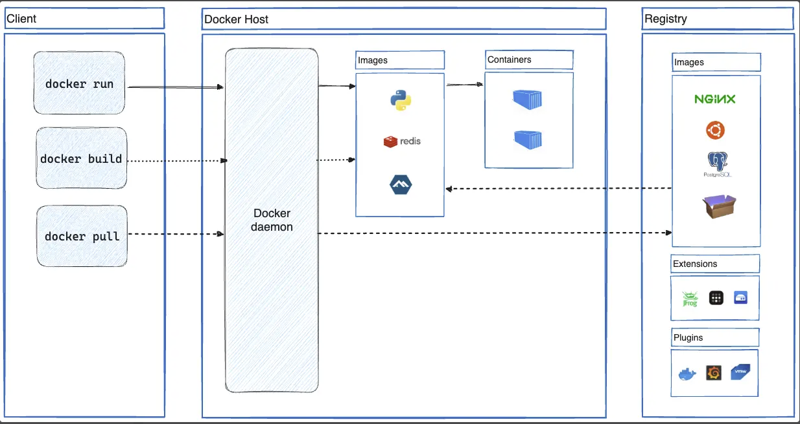

<!-- end_slide -->

A talk about software carpentry
---
How testing enables reproducibility, portability, agility, and collaboration
Introduction slide
<!-- end_slide -->

Traditional Software Engineering
---
# Programming

# Debugging
<!-- end_slide -->


# Practical Taxonomy of Bugs
---
 <!-- pause -->
 # Bugs that prevent execution
 <!-- pause -->
 # Bugs that cause obvious, deterministic, incorrect results
 <!-- pause -->
 # Bugs that lead to incorrect but perfectly plausible results
 <!-- pause -->
 - Or produce incorrect results only under certain conditions

<!-- end_slide -->


<!-- column_layout: [2, 1] -->

<!-- column: 0 -->


<!-- column: 1 -->
_"By June 1949, people had begun to realize that it was not so easy to get a program right as had at one time appeared. It was on one of my journeys between the EDSAC room and the punching equipment that the realization came over me with full force that a good part of the remainder of my life was going to be spent in finding errors in my own programs."_
 
 - Maurice Wilkes, creator of the first stored-program computer, EDSAC
 "Memoirs of a Computer Pioneer" (1985)
<!-- end_slide -->
<!-- reset_layout -->

# Low availability of code in ecology: A call for urgent action, Culina _et al_, 2020
---
<!-- column_layout: [2, 1] -->
<!-- column: 0 -->
* Randomly selected 346 articles published between 2015 and 2019.
* Only 21% could provide (partial) code.

<!-- column: 1 -->

[Low availability of code in ecology: A call for urgent action, Culina et al, 2020](https://journals.plos.org/plosbiology/article?id=10.1371/journal.pbio.3000763)
<!-- end_slide -->
<!-- reset_layout -->


# Debugging Commandments 
---
- Reproduce with the smallest example. In the simplest environment.
- Change one thing at a time.
- Divide and conquer. 
- Be open to debugging in different environments.
- State your assumptions.
- When in doubt, start with the most recent changes (especially dependencies changes).
- Make sure the code you’re looking at is actually getting executed (deployed code, external dependencies, etc.)
- Reduce the feedback loop — figure out the quickest way to test your debugging hypotheses.
- Validate your inputs.

<!-- end_slide -->

> Everyone knows that debugging is twice as hard as writing a program in the first place. So if you're as clever as you can be when you write it, how will you ever debug it?" 
— Kernighan, The Elements of Programming Style (1974)

<!-- end_slide -->

<!-- jump_to_middle -->
 [Software Carpentry](https://www.youtube.com/watch?v=8qzVV7eEiaI)
<!-- end_slide -->

>Software is both a cause of unreliable research and part of the solution.
>The bulk of scientific research relies upon specialized software for data
>management and analysis. The bad news is that much of this software is poorly
>tested and documented, and researchers often use software in unreliable ways.
<!-- pause -->

>Part of the problem is that researchers are being asked to perform a job they
>have not been trained for: software development.
<!-- pause -->

<!-- end_slide -->


A lot of contemporary science involves software development
<!-- pause -->
this is a thing that I think shocks a lot of people when you get into science you're fascinated by some scientific context and then you
<!-- pause -->
learn you have to code right 
<!-- pause -->
it's terrible 
<!-- pause -->
it's like a bait and switch right you get interested in Psychology uh
<!-- pause -->
now you have to learn R
<!-- pause -->
yeah and sorry but this is just the way it's going to be from now on
<!-- end_slide -->


Software development is now a routine part of being a professional scientist and even if you don't code yourself you're using software and you have a responsibility
to understand how it works.
<!-- pause -->
Software development is a profession; it is highly professionalized now and it's actually also quite new.
I would say really the last 20 years have been a period of very rapid professionalization and tool building in software development.

<!-- pause -->
_Software engineering and research_ is the side of this that's just getting started where we take some of these tools, not necessarily
the whole package.

<!-- pause -->
We're not interested in copying software developers but we're interested in borrowing the things that we need.

<!-- pause -->
Version Control and testing are things that are becoming more common in the Sciences but are still incredibly rare. 


<!-- end_slide -->


<!-- jump_to_middle -->
[](https://software-carpentry.org/)
<!-- end_slide -->


Testing
---
# Unit Testing
<!-- pause -->
- Build infrastructure to automate debugging
<!-- pause -->
  * Test the smallest possible unit of code
  * Test the code in isolation
  * Document and test each assumption and intention
<!-- pause -->
# Test-Driven Development
<!-- pause -->
* Write tests before writing code
* Write code to pass the tests


<!-- end_slide -->

# List of unit testing frameworks by language:
---
[](https://en.wikipedia.org/wiki/List_of_unit_testing_frameworks)
<!-- end_slide -->

# Unit test frameworks for R:

| Name | xUnit | Source	
| --- | --- | ---
| RUnit	| No| 		Open source
| testthat| 	Yes| 	Open source
| tinytest| 	Yes| 		Open source
<!-- end_slide -->

Function reference
Expectations

Objects
### expect_equal() expect_identical()
- _Does code return the expected value?_
### expect_type() expect_s3_class() expect_s4_class()
- _Does code return an object inheriting from the expected base type, S3 class, or S4 class?_

Vectors
expect_length()
Does code return a vector with the specified length?
expect_lt() expect_lte() expect_gt() expect_gte()
Does code return a number greater/less than the expected value?
expect_setequal() expect_contains() expect_in()
Does code return a vector containing the expected values?
expect_true() expect_false()
expect_vector()
Does code return a vector with the expected size and/or prototype?


<!-- end_slide -->
Unit Testing
---
# What is a unit test?
<!-- end_slide -->
```r
# Function to roll a single 6-sided die
roll_die <- function() {
  return(sample(1:6, 1))
}

# Function to roll multiple dice and return the sum
roll_multiple_dice <- function(num_dice) {
dice_rolls <- replicate(num_dice, roll_die())
return(sum(dice_rolls))
}

# Function to simulate multiple rolls of multiple dice
simulate_multiple_rolls <- function(num_rolls, num_dice) {
rolls <- replicate(num_rolls, roll_multiple_dice(num_dice))
return(rolls)
}
```
<!-- end_slide -->

```r
library(testthat)

# Load the code file
source("dice_roll_simulation.R")

# Test cases
test_that("roll_die returns values between 1 and 6", {
  rolls <- replicate(1000, roll_die())
  expect_true(all(rolls >= 1 & rolls <= 6))
})

test_that("multiplerolls returns the expected distribution", {
  num_rolls <- 10000
  num_dice <- 3
  expected_mean <- num_dice * 3.5
  expected_sd <- sqrt(num_dice * 35 / 12)
  rolls <- simulate_multiple_rolls(num_rolls, num_dice)
  expect_equal(mean(rolls), expected_mean, tolerance = 0.1)
  expect_equal(sd(rolls), expected_sd, tolerance = 0.1)
})
```

<!-- end_slide -->

<!-- end_slide -->
Testthat
---
```bash +exec
cd dice
Rscript --vanilla testthat_dice_roll_simulation.R
```
<!-- end_slide -->


Testthat
---
```bash +exec
Rscript --vanilla -e "testthat::test_file(\"dice/testthat_dice_roll_simulation.R\")"
```


<!-- end_slide -->

> Unimpressed-Face.gif

<!-- end_slide -->

# Now, a "War Story"
---

<!-- end_slide -->
Testthat
---
```bash +exec
cd src
Rscript --vanilla testthat_sirr.r
```
<!-- end_slide -->
Testthat
---
```bash +exec
pwd
```
<!-- end_slide -->

Testthat
---
```bash +exec
Rscript --vanilla -e "testthat::test_file(\"src/testthat_sirr.r\")"
```


<!-- end_slide -->

- Coding Best Practices
- Trad Software Development
- Programming, Debugging (thats it)
- this may be what your process looks like

- Software Carpentry
- McElreath, quotes, motivation

- McElreath essential tools: version control, unit testing, documentation, continuous integration
- But he doesn't actually teach these things

- I will talk about unit testing and Docker, which is increasingly part of continuous integration

- Debugging, how do you do this?  Smallest replicable example

- Unit Testing is building infrastructure to automate debugging
- You don't want to manually execute your code in rstudio, why manually debug it?


- Docker is building infrastructure to automate deployment

<!-- end_slide -->
Continuous Integration
---
<!-- pause -->
- Unit Testing is building infrastructure to automate debugging

<!-- pause -->
- Continuous Integration is building infrastructure to automate testing and deployment
<!-- end_slide -->


# Docker
---
<!-- pause -->
- What is Docker?
<!-- pause -->

<!-- pause -->
- Why use Docker?
<!-- pause -->
  - Reproducibility
  - Portability
  - Collaboration
<!-- end_slide -->


<!-- end_slide -->
https://hub.docker.com/repository/docker/bwlambert/sir_example/general
<!-- end_slide -->


# Docker build and run
---
```shell
docker build -t "sir_example" .
```
<!-- end_slide -->


